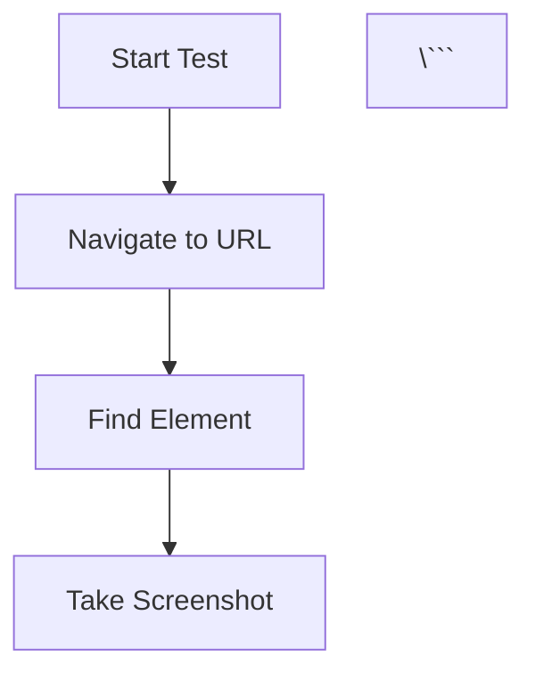

# Doc Detective Documentation - AI Coding Agent Instructions

This document provides guidance for AI coding agents working on the Doc Detective documentation website.

## Architecture and Core Concepts

This is a [Docusaurus](https://docusaurus.io/) v3 website. The primary purpose is to provide documentation for the `doc-detective` tool.

- **Configuration**: The main configuration file is `docusaurus.config.ts`. It controls navigation, plugins, sidebars, and integrations.
- **Content**: Documentation is written in Markdown and located in the `docs/` directory. The sidebar structure is defined in `sidebars.ts`.
- **Components**: Custom React components are in `src/components/`. These are used to enhance the documentation pages. The site uses TypeScript and React.
- **Styling**: Custom CSS is located in `src/css/custom.css`.
- **JSON Schemas**: The project uses `docusaurus-json-schema-plugin` to render JSON schema documentation. A custom script (`.scripts/buildSchemaReferencesV4.js`) runs before builds (`npm run build-schemas`) to process these schemas. This is a key part of documenting the configuration for Doc Detective.

## Development Workflow

1.  **Setup**:
    - To install dependencies, run `npm install`.
    - To start the local development server, run `npm run start`. The site will be available at `http://localhost:3000`.

2.  **Common Tasks**:
    - **Build**: To create a production build, run `npm run build`.
    - **Component Development**: [Storybook](https://storybook.js.org/) is used for UI component development. Run `npm run storybook` to start the Storybook server. Component stories are in `src/stories/`.

## Testing

A unique aspect of this project is that it uses **Doc Detective to test its own documentation**.

- **Test Execution**: To run the tests, use the command: `npm run doc-detective`.
- **Test Files**: The tests are defined in `.spec.json` files. These files contain a series of steps that Doc Detective executes against the live documentation site to ensure it's accurate. An example can be found at `docs/sampletest.spec.json`.
- **Workflow**: This "dogfooding" approach is a critical workflow. When you change documentation related to a feature, you should review the corresponding `.spec.json` file to see if the test needs to be updated.

## Key Conventions

- **Adding Docs**: To add a new documentation page, create a new `.mdx` file in the appropriate subdirectory within `docs/` and add it to `sidebars.ts`.
- **Custom Components**: You can create custom React components in `src/components/` and use them within your `.mdx` files or as custom pages in `src/pages/`.
- **Deployment**: The site is automatically deployed via GitHub Pages when changes are merged into the `main` branch. The deployment process uses the `gh-pages` branch.

## Docusaurus Implementation Guide

This site uses Docusaurus v3 with MDX support. Here are the key features and how to use them:

### Admonitions (Callout Boxes)

Use admonitions to highlight important information. Available types: `note`, `tip`, `info`, `warning`, `danger`.

```markdown
:::info
Drag-and-drop has many different implementations, and Doc Detective wants to support them all.
:::

:::warning
Make sure to set the port number to `8080` in your VSCode settings.
:::
```

**With custom titles:**
```markdown
:::tip[Pro tip]
Use plugins to introduce shorter syntax for commonly used JSX elements.
:::
```

### Tabs for Multi-Option Content

Use tabs to present multiple alternatives (like different programming languages or platforms):

```mdx
import Tabs from "@theme/Tabs";
import TabItem from "@theme/TabItem";

<Tabs>
  <TabItem value='python' label='Python'>
    ```bash
    python -m http.server 8080
    ```
  </TabItem>
  <TabItem value='node' label='Node.js'>
    ```bash
    npx http-server
    ```
  </TabItem>
</Tabs>
```

### Code Blocks with Features

Code blocks support syntax highlighting, titles, and line numbers:

```markdown
```json title="homepage-check.spec.json"
{
  "tests": [
    {
      "steps": []
    }
  ]
}
\```
```

### Mermaid Diagrams

The site has `@docusaurus/theme-mermaid` enabled. Create diagrams with:

```markdown


### Custom React Components in MDX

Import and use React components directly in `.mdx` files:

```mdx
import JSONSchemaViewer from "@theme/JSONSchemaViewer";
import { schemas } from "doc-detective-common";

<JSONSchemaViewer schema={ schemas.dragAndDrop_v3 } />
```

**Available custom components:**
- `JSONSchemaViewer`: Renders JSON schema documentation (from `docusaurus-json-schema-plugin`)
- `CodeBlock`: Enhanced code blocks from `@theme/CodeBlock`
- Custom components in `src/components/`: `JSONBlock`, `SchemaForms`, etc.

### Front Matter

Always include front matter for docs:

```markdown
---
title: dragAndDrop
description: Drag an element to a target location.
sidebar_label: Drag and Drop
---
```

### File Extensions

- **Always use `.mdx`** for documentation files (even if you're not currently using React components or JSX)
- This provides flexibility to add React components later without renaming files
- Docusaurus handles both Markdown and MDX syntax in `.mdx` files

## Content and Style Guide

### Google Developer Style Guide

All documentation must follow the [Google Developer Style Guide](https://developers.google.com/style). Key principles:

**Voice and Tone:**
- Write conversationally and friendly, like a knowledgeable friend, without being frivolous or overly colloquial
- Avoid buzzwords, jargon, exclamation marks (except rare exciting moments), and phrases like "simply" or "it's easy"
- Don't use "please" in instructions: ✅ "Click **View**" not ⛔ "Please click **View**"

**Language and Grammar:**
- Use second person ("you") rather than first person ("we")
- Use active voice: ✅ "Click the button" not ⛔ "The button can be clicked"
- Use present tense: ✅ "The API returns data" not ⛔ "The API will return data"
- Put conditions before instructions: ✅ "If you want to save, click **Save**" not ⛔ "Click **Save** if you want to save"

**Formatting:**
- Use sentence case for headings (not Title Case)
- Use numbered lists for sequential steps
- Use bulleted lists for non-sequential items
- Use serial commas (Oxford commas)
- Put code-related text in `code font`
- Put UI elements in **bold**

**Examples of Tone:**
- ✅ Good: "To get the user's phone number, call `user.phoneNumber.get`."
- ⛔ Too casual: "Dude! This API is totally awesome!"
- ⛔ Too formal: "The telephone number can be retrieved by the developer via the simple expedient of using the get method."

### The Good Docs Project Templates

When creating new documentation, use templates from [The Good Docs Project](https://gitlab.com/tgdp/templates/-/releases) as a starting point to ensure consistent, user-friendly structure:

**Concept** - Explains what something is and why it matters (background knowledge)
```markdown
# Test contexts

A test context is a logical grouping of test specifications that share
common configuration settings.

## What is a test context?

A test context defines the environment and settings for running tests,
including the browser type, viewport size, and application URL.

## Why use test contexts?

Test contexts let you:
- Run the same tests across different environments
- Share configuration across multiple test files
- Organize tests by application area or user role

## When to use test contexts

Use test contexts when you need to test the same functionality across
multiple browsers or configurations.
```

**How-To** - Task-oriented guides for accomplishing specific goals
```markdown
# How to validate form inputs

This guide shows you how to test form validation in your documentation.

## Before you begin

- Install Doc Detective
- Have a test specification file ready

## Validate required fields

1. Navigate to the form page:
   ```json
   {"action": "goTo", "url": "https://example.com/form"}
   ```

2. Submit the form without filling required fields:
   ```json
   {"action": "click", "selector": "#submit-button"}
   ```

3. Verify the error message appears:
   ```json
   {"action": "find", "selector": ".error-message", 
    "matchText": "This field is required"}
   ```

## What's next

- Learn about [testing user workflows](link)
- Explore [advanced validation patterns](link)
```

**Tutorial** - Learning-oriented lessons that guide users through a complete workflow
```markdown
# Create your first test

In this tutorial, you create a simple test that validates a documentation
page loads correctly and contains the expected content.

## What you'll learn

- How to structure a test specification
- How to navigate to a page
- How to verify page content

## What you'll need

- Node.js 18 or later
- 15 minutes

## Step 1: Create a test specification file

Create a file named `first-test.spec.json`:

```json
{
  "tests": [
    {
      "id": "my-first-test",
      "description": "Verify homepage loads"
    }
  ]
}
```

## Step 2: Add navigation

Add a `goTo` action to navigate to your documentation:

```json
{
  "tests": [
    {
      "id": "my-first-test",
      "description": "Verify homepage loads",
      "steps": [
        {"action": "goTo", "url": "https://doc-detective.com"}
      ]
    }
  ]
}
```

## Step 3: Run your test

Run the test with the Doc Detective CLI:

```bash
npx doc-detective runTests --input first-test.spec.json
```

You should see output indicating the test passed.

## What you learned

You created a basic test specification and ran it successfully.

## Next steps

- Add content validation with the `find` action
- Learn about [test contexts](link)
```

**Reference** - Information-oriented technical descriptions (API docs, configuration options)
```markdown
# goTo action

Navigates the browser to a specified URL.

## Syntax

```json
{
  "action": "goTo",
  "url": "string"
}
```

## Parameters

| Parameter | Type   | Required | Description |
|-----------|--------|----------|-------------|
| action    | string | Yes      | Must be "goTo" |
| url       | string | Yes      | The URL to navigate to. Must include protocol (http:// or https://) |

## Examples

### Navigate to a documentation page

```json
{
  "action": "goTo",
  "url": "https://doc-detective.com/docs/get-started"
}
```

### Navigate to localhost

```json
{
  "action": "goTo",
  "url": "http://localhost:3000"
}
```

## Related actions

- `find` - Verify elements exist on the page
- `click` - Interact with page elements
```
