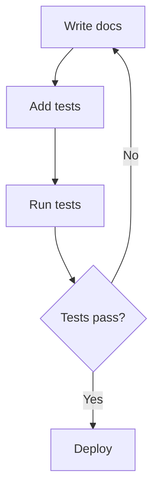

import Tabs from "@theme/Tabs";
import TabItem from "@theme/TabItem";

# Substantial changes (30+ minutes)

Major documentation projects that significantly expand or improve the Doc Detective documentation.

## What counts as substantial

- Documenting new features or major changes
- Writing complete tutorials from scratch
- Major restructuring of existing documentation
- Creating comprehensive reference documentation
- Large-scale content updates (multiple pages)
- Adding new documentation categories

## Before you start

For substantial contributions, it's important to align with maintainers before investing significant time:

1. **Check for existing issues**: Look for [documentation issues](https://github.com/doc-detective/doc-detective.github.io/issues?q=is%3Aissue+is%3Aopen+label%3Adocumentation) or feature requests.
2. **Open a discussion**: If no issue exists, open one describing your plans.
3. **Get feedback**: Wait for maintainer input before starting major work. If you don't hear back in a few days, politely ping in the issue or on [Discord](https://discord.gg/2M7wXEThfF).
4. **Claim the work**: Comment on the issue to let others know you're working on it.

This prevents duplicate effort and ensures your contribution aligns with project goals.

## Required: Local development environment

Substantial contributions require a local development environment to efficiently work across multiple files and see real-time previews.

👉 See [Local development](local-development) for detailed instructions.

## Plan your contribution

### Understand the user journey

Before writing, consider

- **Who** is the target audience?
- **What** are they trying to accomplish?
- **Why** would they read this documentation?
- **When** in their journey will they need this?

### Choose the right content type

Use templates to structure your content:

#### Tutorial

Tutorials guide users through learning a concept end-to-end. You should use them when users need to understand a complete workflow or feature.

👉 [Tutorial template](templates/tutorial)

#### How-to guide

How-to guides help users accomplish a specific task. They're generalized instructions for common tasks. They're great when users know what they want to do but need instructions.

👉 [How-to template](templates/how-to)

#### Reference

References provide technical specifications and details and are useful when users need to look up specific information.

👉 [Reference template](templates/reference)

#### Feature documentation

Feature docs are conceptual overviews about what a feature can do and why/when you'd want to use it. They're educational and should be created or updated when a feature is new or has changed significantly.

👉 [Feature template](templates/feature)

## Writing substantial documentation

### Start with an outline

Get feedback on structure before writing full content:

1. Create a draft with section headings and bullet points
2. Commit and push to your branch
3. Open a draft pull request marked "WIP" or "Draft"
4. Request feedback on structure

This prevents rewrites later.

### Write incrementally

Don't try to write everything at once:

1. **Write one section**: Complete a single logical section
2. **Commit and push**: Save your progress
3. **Review locally**: Read it fresh after a break
4. **Move to next section**: Repeat the process

Commit often with clear messages:

- `Add overview section to feature X documentation`
- `Document basic example for Y tutorial`
- `Add troubleshooting section for Z`

### Include comprehensive examples

Substantial documentation needs examples users can learn from:

#### Basic example

Show the simplest use case:

```json title="basic-test.spec.json"
{
  "tests": [
    {
      "steps": [
        {
          "action": "goTo",
          "url": "https://doc-detective.com"
        }
      ]
    }
  ]
}
```

#### Advanced example

Show real-world usage with more complexity:

```json title="advanced-test.spec.json"
{
  "tests": [
    {
      "id": "login-flow",
      "description": "Verify user can log in and access dashboard",
      "steps": [
        {
          "action": "goTo",
          "url": "https://example.com/login"
        },
        {
          "action": "find",
          "selector": "#username"
        },
        {
          "action": "type",
          "keys": "$USERNAME"
        },
        {
          "action": "type",
          "selector": "#password",
          "keys": "$PASSWORD"
        },
        {
          "action": "click",
          "selector": "button[type='submit']"
        },
        {
          "action": "find",
          "selector": ".dashboard",
          "matchText": "Welcome"
        }
      ]
    }
  ]
}
```

### Add visual aids

Consider adding

- **Diagrams**: Use [Mermaid](https://mermaid.js.org/) for flowcharts and diagrams
- **Screenshots**: Show key UI elements or results
- **Videos**: For complex workflows (link to hosted videos)

Example Mermaid diagram:

<Tabs>
<TabItem value="markdown" label="Markdown" default>
````markdown

````
</TabItem>
<TabItem value="rendered" label="Rendered">

</TabItem>
</Tabs>

## Testing your documentation

### Build locally

Ensure the site builds without errors:

```bash
npm run build
```

Fix any build errors before submitting.

### Test your examples

Every code example should be tested:

1. **Run the code**: Verify examples work as shown
2. **Test variations**: Ensure options are documented correctly
3. **Check edge cases**: Document limitations if found

{/* ### Doc Detective tests

If your documentation includes testable procedures, consider adding Doc Detective tests:

```json title="your-feature.spec.json"
{
  "tests": [
    {
      "id": "test-your-documentation",
      "description": "Verify the documented procedure works",
      "steps": [
        // Add steps that follow your documentation
      ]
    }
  ]
}
```

Place test files in the same directory as the documentation they test.

👉 See [Testing Guide](testing) for details on writing Doc Detective tests */}

## Review process for substantial contributions

### Initial review

Expect more detailed feedback on substantial contributions:

1. **Technical accuracy**: Is the information correct?
2. **Content organization**: Is the structure logical?
3. **Completeness**: Are there gaps that need filling?
4. **Examples**: Are they clear and correct?
5. **Writing quality**: Is it clear and concise?

### Iterative improvement

Don't expect to get it perfect on the first try:

1. **Address feedback**: Make requested changes.
2. **Ask questions**: If feedback is unclear, ask for clarification.
3. **Suggest alternatives**: If you disagree, explain your reasoning.
4. **Iterate**: Multiple review rounds are normal.

### Technical writer involvement

For substantial contributions, a technical writer may:

- Provide structural feedback
- Suggest alternative approaches
- Help with clarity and consistency
- Polish language and formatting

This is collaborative—your subject matter expertise plus writing expertise produces the best documentation.

## After your contribution is merged

Celebrate! 🎉 You've made a significant contribution to Doc Detective. Thank you!

### Share your work

Help others discover your contribution:

- Share on social media. Doc Detective is active [on LinkedIn](https://www.linkedin.com/company/doc-detective) and will happily reshare contribution announcements.
- Mention it in the Discord server.
- Add it to your portfolio.

## Need help?

Substantial contributions benefit from collaboration:

- **Planning phase**: Discuss your approach in the issue or Discord.
- **During writing**: Ask questions in draft pull requests.
- **During review**: Don't hesitate to ask for clarification.
- **Stuck?**: Reach out in [Discord](https://discord.gg/2M7wXEThfF)—maintainers are happy to help.

## Recognition

Substantial contributions are highlighted:

- Release notes mention significant documentation improvements
- Contributors page lists all contributors
- Social media shoutouts for major contributions

Thank you for investing your time in improving Doc Detective documentation!
