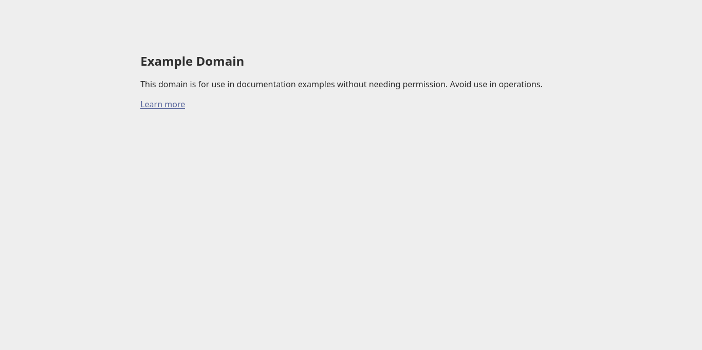

import spec from "./sample.spec.json";
import CodeBlock from '@theme/CodeBlock';
import Tabs from '@theme/Tabs';
import TabItem from '@theme/TabItem';

# Installation

Downloading and running Doc Detective is straightforward. You can install Doc Detective using NPX (Node.js) or Docker. Follow the instructions for your preferred method:

<Tabs>
  <TabItem value="npx" label="NPX" default>

1. Install prerequisites:

    - [Node.js](https://nodejs.org/) v18 or later

2. In a terminal, install Doc Detective globally:

    <CodeBlock language="bash" title="Install Doc Detective">
      npm i -g doc-detective
    </CodeBlock>
    {/* step runShell: "npm i -g doc-detective" */}

    :::note

    If you're working in a local copy of the `doc-detective` repository, you need to run `npm i` to install local dependencies.

    :::

3.  Save this file to your current directory as _sample.spec.json_:

    <CodeBlock language="json" title="sample.spec.json">
      {JSON.stringify(spec, null, 2)}
    </CodeBlock>

4. Run a test, pointing to the file you just created:

    <CodeBlock language="bash" title="Run test">
      npx doc-detective --input sample.spec.json
    </CodeBlock>
    {/* step runShell:
    command: "npx doc-detective --input sample.spec.json"
    workingDirectory: "." */}

  </TabItem>
  <TabItem value="docker" label="Docker">

1. Install prerequisites:

    - [Docker](https://docs.docker.com/get-docker/)

2. Pull the Doc Detective Docker image:

    <CodeBlock language="bash" title="Pull Docker image">
      docker pull docdetective/doc-detective
    </CodeBlock>

3. Save this file to your current directory as _sample.spec.json_:

    <CodeBlock language="json" title="sample.spec.json">
      {JSON.stringify(spec, null, 2)}
    </CodeBlock>

4. Run a test, pointing to the file you just created:

    <Tabs groupId="os">
      <TabItem value="unix" label="Linux/macOS" default>
        <CodeBlock language="bash" title="Run test">
          {"docker run -v $(pwd):/workspace docdetective/doc-detective --input /workspace/sample.spec.json"}
        </CodeBlock>
      </TabItem>
      <TabItem value="windows-powershell" label="Windows (PowerShell)">
        <CodeBlock language="powershell" title="Run test">
          {"docker run -v ${PWD}:/workspace docdetective/doc-detective --input /workspace/sample.spec.json"}
        </CodeBlock>
      </TabItem>
      <TabItem value="windows-cmd" label="Windows (cmd)">
        <CodeBlock language="cmd" title="Run test">
          {"docker run -v %cd%:/workspace docdetective/doc-detective --input /workspace/sample.spec.json"}
        </CodeBlock>
      </TabItem>
    </Tabs>

    :::note

    This command mounts your current directory to `/workspace` in the container, giving Doc Detective access to your test specification and enabling it to output results and screenshots.

    :::

  </TabItem>
</Tabs>

Congratulations! You've run your first test with Doc Detective. :tada:

You should see output in the terminal indicating the progress and results of the test. Results are also saved in a `testResults-<timestamp>.json` file in the current directory (configurable with the `--output` option), and this test saves a screenshot to example.png:

## Next steps

Next up, take a look at some of the [concepts](/docs/get-started/concepts) native to Doc Detective, check out some of the guided [tutorials](/docs/category/tutorials), or explore how to write [tests](/docs/get-started/tests) and [actions](/docs/category/actions) to automate your documentation testing.