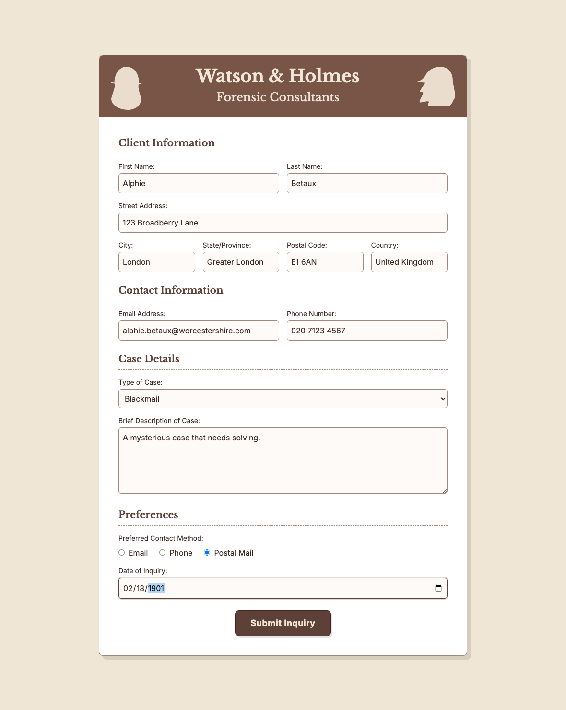

# Capture screenshot

This example fills in all of the fields on the Watson and Holmes Intake Form, then captures a screenshot of the result for posterity.

To run the test:

1. Download the TestExamples Zip file and expand doc-detective-tutorials on your local drive.
2. In a terminal window, navigate to the doc-detective-tutorials directory.
3. Start your local server, if it isn't currently running. For example, enter the command `live-server`.
4. Enter the command `npx doc-detective@dev -i form-filler2.json

While the form is too large to fit on the computer screen, increasing the window and viewport settings allows you to capture the entire form in a single image.



## Code walkthrough

These are the notable additions to the script.

To capture the full form, this example runs in _headless_ mode. The screenshot can then capture the entire virtual viewport.

```json
                    "browsers": {
                        "name": "chrome",
                        "headless": true,
                        "window": {
                            "width": 1200,
                            "height": 1500
                        },
                        "viewport": {
                            "width": 1180,
                            "height": 1480
                        }
                    }
```

Filling in most of the fields is the same as filling in the First and Last Name values in the previous example. You find an element by its label, click the element, then type a value. 

```json
                {
                    "description": "Type in the Street Address",
                    "find": {
                        "elementText": "Street Address:",
                        "click": true,
                        "type": "123 Broadberry Lane"
                    }
                },
```

You use the same syntax to enter the value in a drop-down menu; for example, the Type of Case.

```json
                {
                    "description": "Select the Type of Case",
                    "find": {
                        "elementText": "Type of Case:",
                        "click": true,
                        "type": "Blackmail"
                    }
                },
```

You can click a radio button directly by name.

```json
                {
                    "description": "Click the Postal Mail button",
                    "click": "Postal Mail"
                },
```

Use the screenshot action with an output path to capture the state of the form once the fields are complete. 

```json

                {
                    "description": "Capture a screenshot of the completed form.",
                    "screenshot": "./output/form-filled-2-complete.png"
                },
```


## Complete code sample

```json
{
    "tests": [
        {
            "runOn": [
                {
                    "platforms": [
                        "windows",
                        "mac",
                        "linux"
                    ],
                    "browsers": {
                        "name": "chrome",
                        "headless": true,
                        "window": {
                            "width": 1200,
                            "height": 1500
                        },
                        "viewport": {
                            "width": 1180,
                            "height": 1480
                        }
                    }
                }
            ],
            "steps": [
                {
                    "description": "Go to the specified URL",
                    "goTo": "http://localhost:8080/watson_and_holmes_intake_form.html"
                },
                {
                    "description": "Type in the First Name",
                    "find": {
                        "elementText": "First Name:",
                        "click": true,
                        "type": "Alphie"
                    }
                },
                {
                    "description": "Type in the Last Name",
                    "find": {
                        "elementText": "Last Name:",
                        "click": true,
                        "type": "Betaux"
                    }
                },
                {
                    "description": "Type in the Street Address",
                    "find": {
                        "elementText": "Street Address:",
                        "click": true,
                        "type": "123 Broadberry Lane"
                    }
                },
                {
                    "description": "Type in the City",
                    "find": {
                        "elementText": "City:",
                        "click": true,
                        "type": "London"
                    }
                },
                {
                    "description": "Type in the State/Province",
                    "find": {
                        "elementText": "State/Province:",
                        "click": true,
                        "type": "Greater London"
                    }
                },
                {
                    "description": "Type in the Postal Code",
                    "find": {
                        "elementText": "Postal Code:",
                        "click": true,
                        "type": "E1 6AN"
                    }
                },
                {
                    "description": "Type in the Country",
                    "find": {
                        "elementText": "Country:",
                        "click": true,
                        "type": "United Kingdom"
                    }
                },
                {
                    "description": "Type in the Email Address",
                    "find": {
                        "elementText": "Email Address:",
                        "click": true,
                        "type": "alphie.betaux@worcestershire.com"
                    }
                },
                {
                    "description": "Type in the Phone Number",
                    "find": {
                        "elementText": "Phone Number:",
                        "click": true,
                        "type": "020 7123 4567"
                    }
                },
                {
                    "description": "Select the Type of Case",
                    "find": {
                        "elementText": "Type of Case:",
                        "click": true,
                        "type": "Blackmail"
                    }
                },
                {
                    "description": "Type in the Case Description",
                    "find": {
                        "elementText": "Brief Description of Case:",
                        "click": true,
                        "type": "A mysterious case that needs solving."
                    }
                },
                {
                    "description": "Click the Postal Mail button",
                    "click": "Postal Mail"
                },
                {
                    "description": "Type in the Date of Inquiry",
                    "find": {
                        "elementText": "Date of Inquiry:",
                        "click": true,
                        "type": "02/18/1901"
                    }
                },
                {
                    "description": "Capture a screenshot of the completed form.",
                    "screenshot": "./output/form-filled-2-complete.png"
                },
                {
                    "description:": "Pause long enough to see the changes.",
                    "wait": 10000
                }
            ]
        }
    ]
}
```

Next step: [Record video](record-video)
